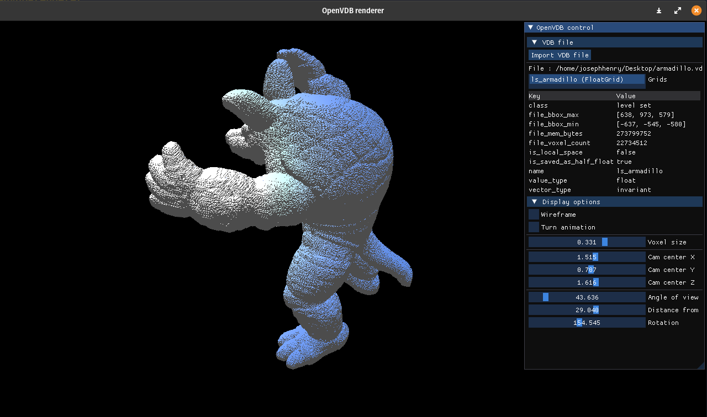
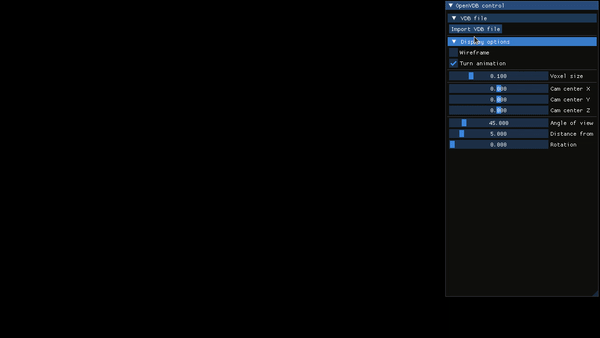

# OpenVDB renderer

A minimalist OpenVDB renderer using OpenGL and ImGui.



(Armadillo VDB model downloaded at : https://www.openvdb.org/download/)



## Description

This project was made at ArtFX - TD 4.

## Getting Started

### Dependencies

This project is using the following libraries : 

- [GLM](https://glm.g-truc.net/0.9.9/index.html) (OpenGL Mathematics)
- [GLFW](https://www.glfw.org/) (Window management)
- [GLEW](http://glew.sourceforge.net/) (OpenGL Extension Wrangler)
- [ImGui](https://github.com/ocornut/imgui) (GUI)
- [imgui-filebrowser](https://github.com/AirGuanZ/imgui-filebrowser) (File browser)
- [OpenVDB](https://www.openvdb.org/about/) (Sparse volumetric data structure library)

**You need to first install OpenVDB by following this link : https://github.com/AcademySoftwareFoundation/openvdb#linux**

```shell
# Installing Dependencies (Boost, TBB, Blosc)
apt-get install -y libboost-iostreams-dev
apt-get install -y libboost-system-dev
apt-get install -y libtbb-dev

# Blosc
git clone git@github.com:Blosc/c-blosc.git
cd c-blosc
git checkout tags/v1.5.0 -b v1.5.0
mkdir build
cd build
cmake ..
make -j4
make install
cd ../..

# OpenVDB
git clone git@github.com:AcademySoftwareFoundation/openvdb.git
cd openvdb
mkdir build
cd build
cmake ..
make -j4
make install
```

### Build

This project is using CMake. To do an out of source build : 

```shell
$ mkdir build && build
$ cmake .. -DCMAKE_MODULE_PATH=/path/to/openvdb/cmake
$ make
```

Note that you need to specify the path to your OpenVDB installation (clone [their repo](https://github.com/AcademySoftwareFoundation/openvdb))

https://academysoftwarefoundation.github.io/openvdb/build.html#buildUsingOpenVDB

### Executing the program

From the build folder, you can launch the program : 

```shell
$ ./openvdb-renderer
```

## Sources
- https://github.com/morizotter/imgui-opengl-glfw-glew-cmake-demo
- https://retifrav.github.io/blog/2019/05/26/sdl-imgui/
- https://academysoftwarefoundation.github.io/openvdb/codeExamples.html
- https://cmake.org/cmake/help/latest/guide/tutorial/index.html
